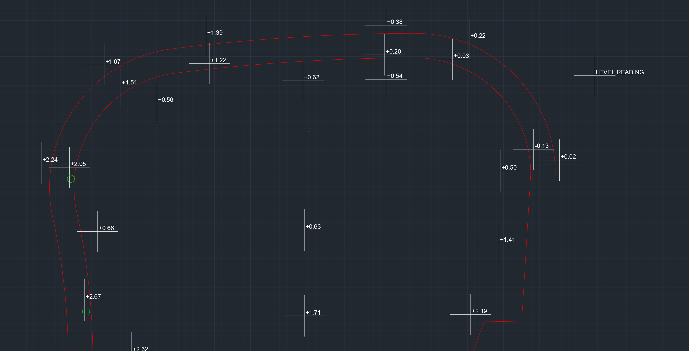
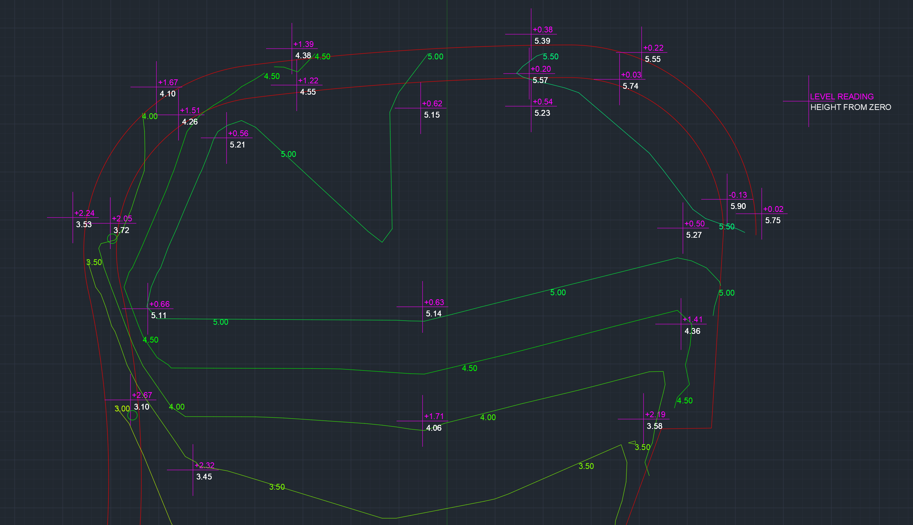

# levler
Converts a dxf file with points and readings from an automatic level to contours

## What it does:
Takes a dxf file like this one:

And adds contour lines and relative heights:


## Usage
```
python level_to_contour.py -h
positional arguments:
  input_file            input file name (required)

options:
  -h, --help            show this help message and exit
  -z ZERO, --zero ZERO  level reading at your zero point
  -o OUTPUT_FILE, --output_file OUTPUT_FILE
                        output file name
  -s, --show_3d         Show a 3d model of the interpolation
  -c, --export_csv      Export a csv as well
  --csv_only            Export only the csv
  -d CONTOUR_Z_DISTANCE, --contour_z_distance CONTOUR_Z_DISTANCE
                        contour z distance
  -r RESOLUTION, --resolution RESOLUTION
                        subdivisions of interpolation grid
  -v, --verbose         verbose
```

## Input file format:
To make such a dxf file, use the acad.dwt template, insert your plot outline and then use PDMODE command to set the point rendering mode to 2. Use the POINT command to place a point and then use MTEXT to add the automatic level reading next to the point. The program will only consider the first line as a value, if there is any text or %%p it will be ignored. Repeat for all readings. Save the file as 2004 dxf.

## How it works:
The program associates POINT objects as the coordinates of the point where a level reading was taken, and uses the nearest MTEXT object as the reading value to calculate the height from the zero point.

## TODO
- 3d point input
- use MTEXT values as heights instead of readings
- Generate cross sections
